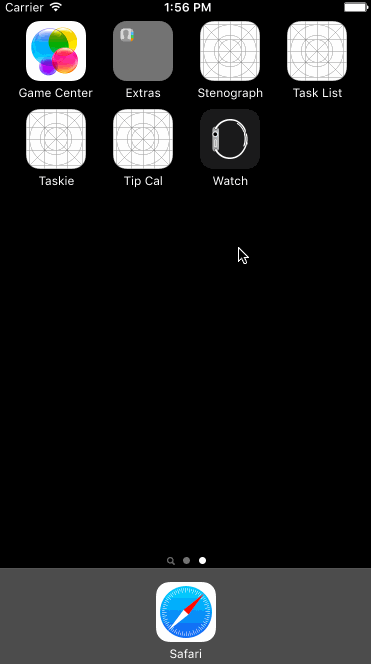

# Pre-work - *Tip Cal*

**Tip Cal** is a tip calculator application for iOS.

Submitted by: **Dam Vu Duy**

Time spent: **4** hours spent in total

## User Stories

The following **required** functionality is complete:

* [x] User can enter a bill amount, choose a tip percentage, and see the tip and total values.
* [x] Settings page to change the default tip percentage.

The following **optional** features are implemented:
* [x] UI animations
* [ ] Remembering the bill amount across app restarts (if <10mins)
* [ ] Using locale-specific currency and currency thousands separators.
* [ ] Making sure the keyboard is always visible and the bill amount is always the first responder. This way the user doesn't have to tap anywhere to use this app. Just launch the app and start typing.

The following **additional** features are implemented:

- [x] Beautiful UI
- [x] Pull the bill down or up to change tip percent

## Video Walkthrough 

Here's a walkthrough of implemented user stories:



GIF created with [LiceCap](http://www.cockos.com/licecap/).

## Notes

I have a little problem with setting icon in navigation bar. I choosed white tint color for it and on simulator it works well, but on my real device it is not really white (little bit dark).
I tried to remove shadow of navigation bar by

```swift
self.navigationController?.navigationBar.shadowImage = UIImage()
```

but it was not work :(

I feel autolayout complicated a litte bit. I don't know how to add padding to text field.'

## License

Copyright [2016] [Dam Vu Duy]

Licensed under the Apache License, Version 2.0 (the "License");
you may not use this file except in compliance with the License.
You may obtain a copy of the License at

http://www.apache.org/licenses/LICENSE-2.0

Unless required by applicable law or agreed to in writing, software
distributed under the License is distributed on an "AS IS" BASIS,
WITHOUT WARRANTIES OR CONDITIONS OF ANY KIND, either express or implied.
See the License for the specific language governing permissions and
limitations under the License.